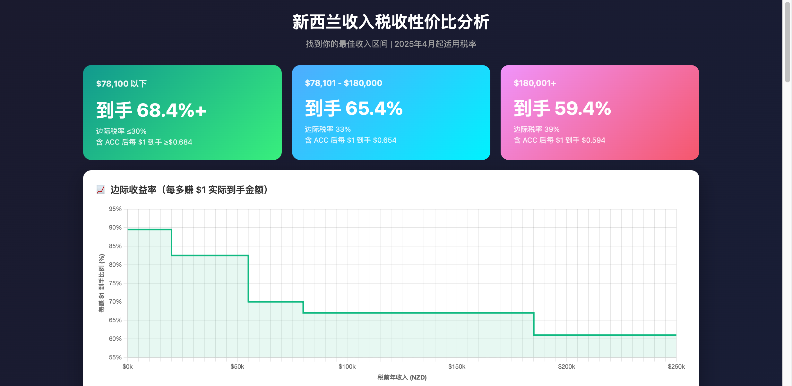
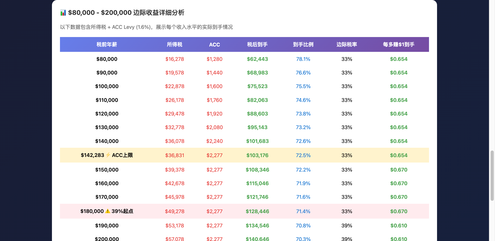
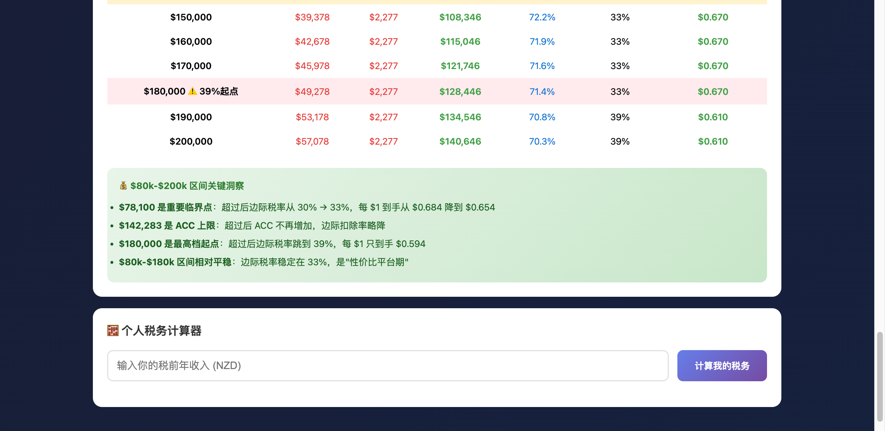
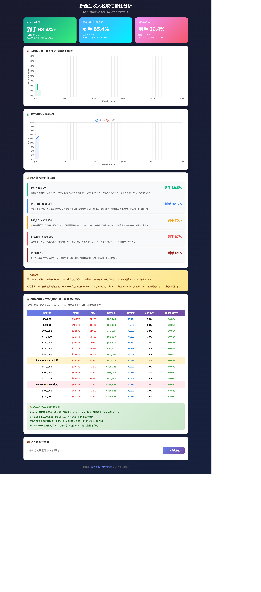

# 新西兰收入税收性价比分析

> 2025年4月起适用税率 | 找到你的最佳收入区间

## 概览

新西兰采用累进税制，不同收入区间的税率不同。了解税率结构可以帮助你更好地规划收入和职业发展。

### 三个收入区间的到手比例

| 收入区间 | 到手比例 | 边际税率 | 每多赚 $1 到手 |
|---------|---------|---------|--------------|
| $78,100 以下 | **68.4%+** | ≤30% | ≥$0.684 |
| $78,101 - $180,000 | **65.4%** | 33% | $0.654 |
| $180,001+ | **59.4%** | 39% | $0.594 |

## 新西兰个人所得税税率 (2025年4月起)

| 收入区间 | 税率 |
|---------|------|
| $0 - $15,600 | 10.5% |
| $15,601 - $53,500 | 17.5% |
| $53,501 - $78,100 | 30% |
| $78,101 - $180,000 | 33% |
| $180,001+ | 39% |

## ACC Levy (意外伤害保险)

除了所得税，还需要缴纳 ACC Levy，税率约为 **1.6%**，上限为年收入 $142,283。

- 收入低于 $142,283：按 1.6% 缴纳
- 收入超过 $142,283：ACC 固定为 $2,277/年

## 详细收益分析表

以下数据包含所得税 + ACC Levy (1.6%)，展示每个收入水平的实际到手情况：

### 常见收入水平参考

| 税前年薪 | 所得税 | ACC | 税后到手 | 到手比例 | 边际税率 | 每多赚$1到手 |
|---------|-------|-----|---------|---------|---------|------------|
| $80,000 | $16,278 | $1,280 | $62,443 | 78.1% | 33% | $0.654 |
| $90,000 | $19,578 | $1,440 | $68,983 | 76.6% | 33% | $0.654 |
| $100,000 | $22,878 | $1,600 | $75,523 | 75.5% | 33% | $0.654 |
| $120,000 | $29,478 | $1,920 | $88,603 | 73.8% | 33% | $0.654 |
| $150,000 | $39,378 | $2,277 | $108,346 | 72.2% | 33% | $0.670 |
| $180,000 | $49,278 | $2,277 | $128,446 | 71.4% | 33% | $0.670 |
| $200,000 | $57,078 | $2,277 | $140,646 | 70.3% | 39% | $0.610 |

## 关键洞察

### 重要临界点

1. **$78,100 是重要临界点**：超过后边际税率从 30% → 33%，每 $1 到手从 $0.684 降到 $0.654

2. **$142,283 是 ACC 上限**：超过后 ACC 不再增加，边际扣除率略降

3. **$180,000 是最高档起点**：超过后边际税率跳到 39%，每 $1 只到手 $0.594

4. **$80k-$180k 区间相对平稳**：边际税率稳定在 33%，是"性价比平台期"

### 收入性价比区间详解

| 收入区间 | 到手比例 | 说明 |
|---------|---------|------|
| $0 - $15,600 | **89.5%** | 最优性价比区间，边际税率仅 10.5% |
| $15,601 - $53,500 | **82.5%** | 性价比依然不错，边际税率 17.5% |
| $53,501 - $78,100 | **70%** | 人称黄金阶段，边际税率跃升至 30% |
| $78,101 - $180,000 | **67%** | 边际税率 33%，中高收入区间，性价比平稳 |
| $180,001+ | **61%** | 最高边际税率 39%，高收入区间 |

## 实用建议

1. **如果你的收入刚好超过 $53,500 一点点**（比如 $55,000-$60,000），可以考虑：
   - 增加 KiwiSaver 贡献率
   - 合理的税务规划

2. **$80k-$180k 是性价比平台期**：在这个区间内涨薪的边际收益相对稳定

3. **超过 $180,000 后**：每多赚 $1 只能到手 $0.594，需要考虑是否值得额外付出

## 完整图表

## 相关资源

- [IRD 官方税率信息](https://www.ird.govt.nz/income-tax/income-tax-for-individuals/tax-codes-and-tax-rates-for-individuals/tax-rates-for-individuals)
- [KiwiSaver 信息](https://www.ird.govt.nz/kiwisaver)

---

> 注：以上数据基于 2025 年 4 月起适用的税率计算，仅供参考。具体税务问题请咨询专业税务顾问。
