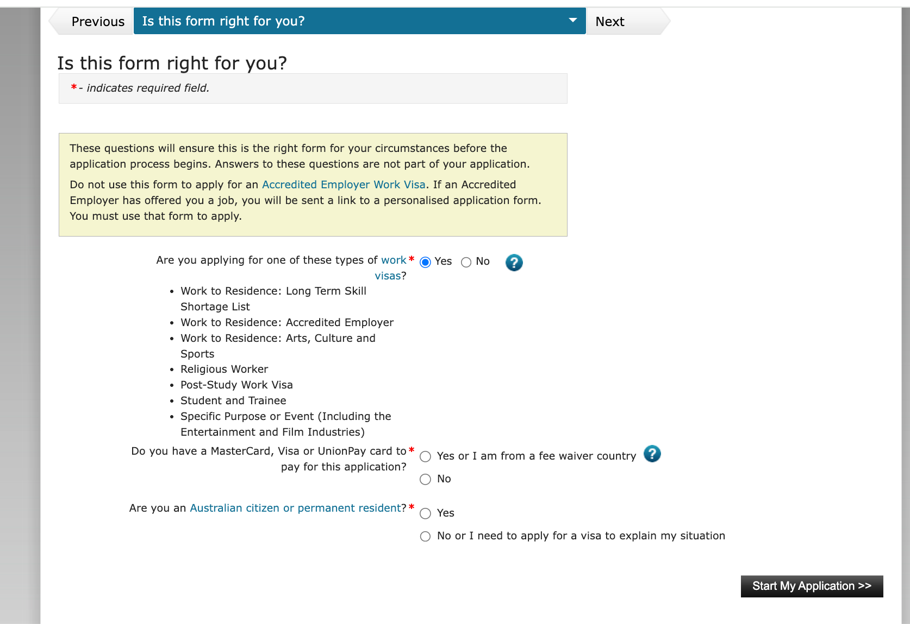
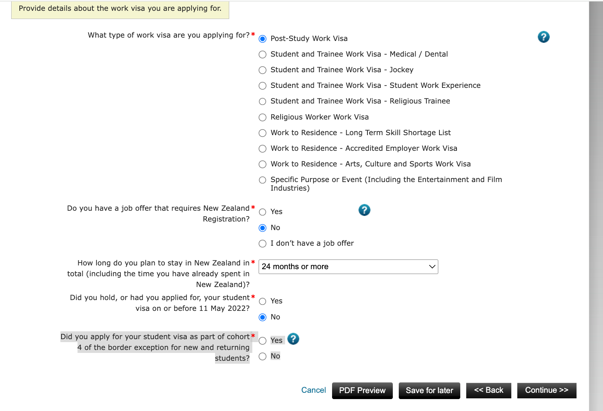
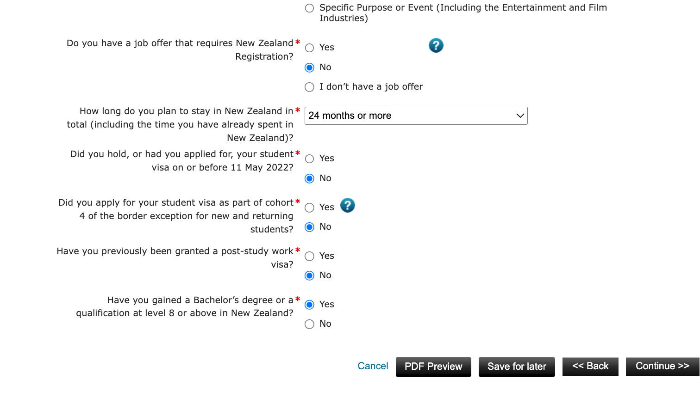
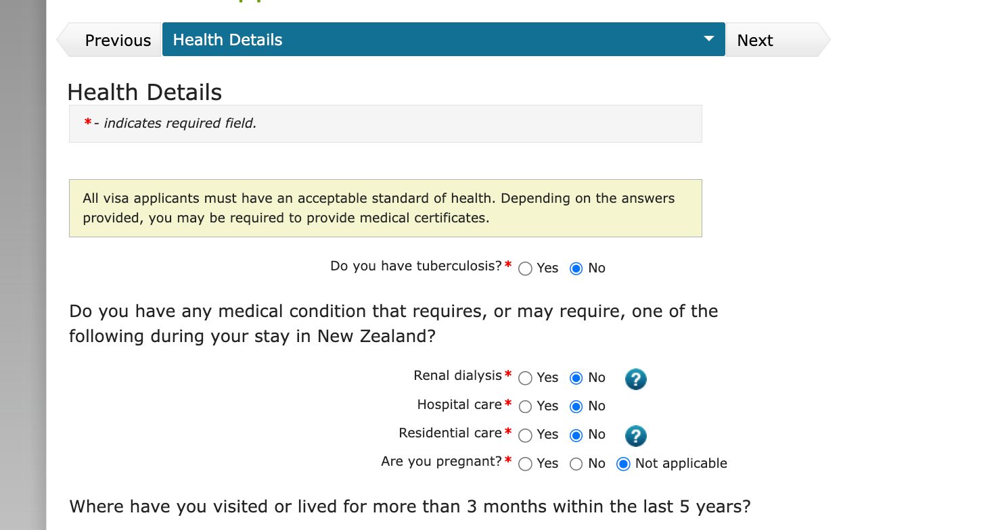
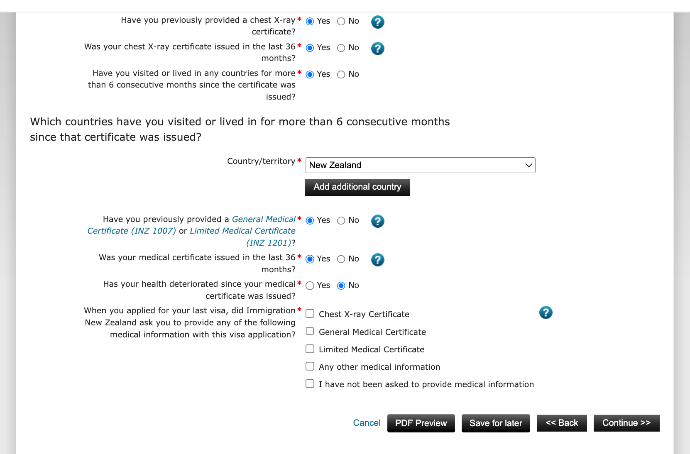
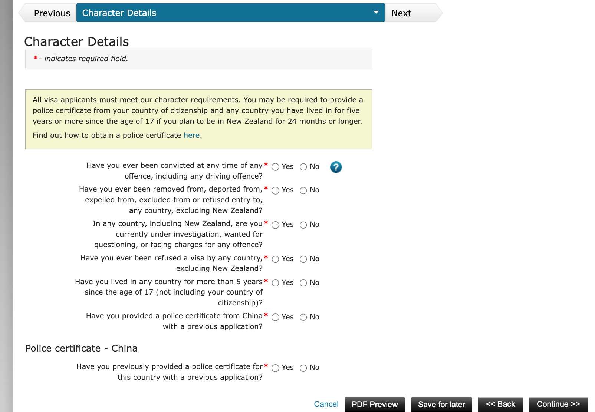
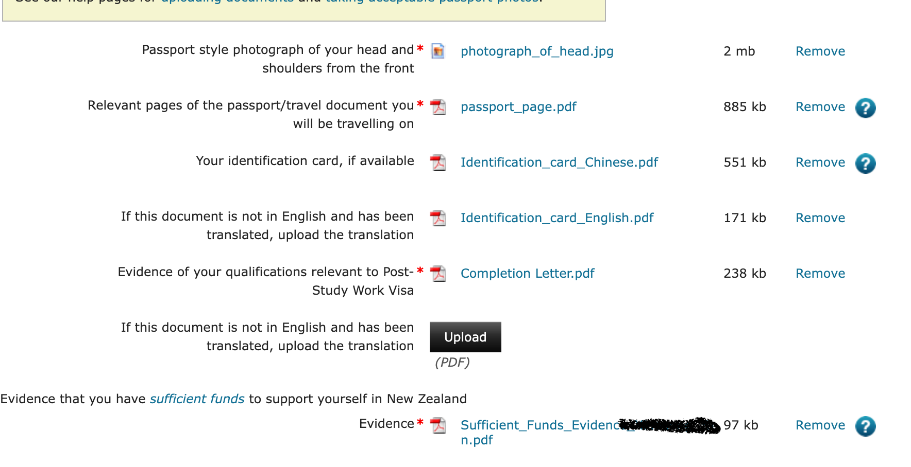
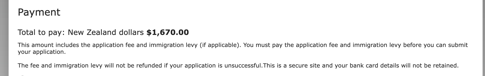
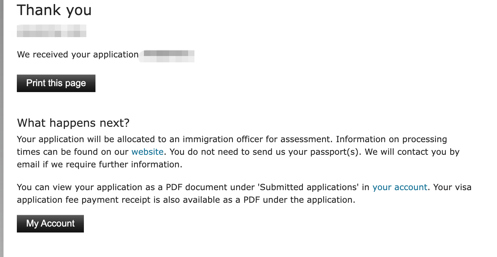

# 手把手教你申请开放工签 (Post-Study Work Visa)

## 准备材料

1. **完成信 (Completion Letter)** - 证明你完成学业，不需要成绩单
2. **体检 1007** - 如之前申请学签时已做过可跳过
3. **无犯罪证明** - 如之前提交过可跳过
4. **存款证明** - 三个月内有效，可用银行信件
5. **申请费 $1,670**

## 不需要的材料

- 不需要 Cover Letter

## 申请步骤

### Step 0: 注册账号

如果没有在移民局注册过账号，先去注册一个 RealMe 账号。

### Step 1: 选择签证类型

登录后点击 "Work Visa"（在 Create a new application 那一排蓝色链接里）

### Step 2: 选择 Post-Study Work Visa

选择 "Post-Study Work Visa"，回答相关问题

### Step 3: 填写健康信息 (Health Details)

### Step 4: 填写无犯罪证明信息 (Character Details)

### Step 5: 代办信息 (Apply on Behalf / Assist)

### Step 6: 上传文件

需要上传的文件：
- 护照照片
- 护照页扫描件
- 身份证（中英文）
- Completion Letter
- 存款证明

### Step 7: 付款

费用：$1,670 NZD

### Step 8: 提交完成

## 小贴士

- 如果着急可以提前准备材料，保存成草稿，等 Completion Letter 下来就立即提交
